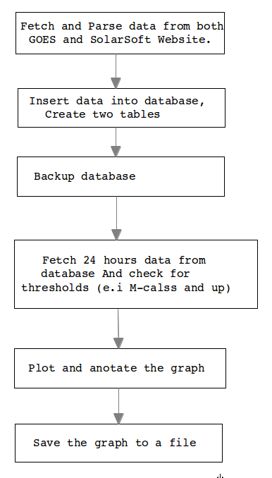

Functional Specification
========================
######Space Weather X-Ray flux with Active Region Numbers Display
######Nomajama Mhaga
######Last Update: 12 May 2014
######Version 0.1
This document explains the fuctional design of the X-ray plot from GOES with annotations of Active Region. 


Overview
---------
For the new display, the program will pull data from online resources. When a flare occurs, an X-ray plot from the GOES with Active Region numbers to see which Active region the flare has come from.

System Flow plan
----------------

Technical Design
----------------
Matplotlib will be used to plot the x-ray which is going to be used in Python script. The data will be pulled from online sources, insert it into a database. Every five minutes a graph will be plotted annotating the areas with the flare i.e from C to X or higher level Class. A for loop will be implemented to determine where it falls under background class or flare class

###Program Flow Chart



###Conditions

1. X-ray solar flare 
   Background: between A and C level
   flare: between C and X
2. Solar soft (Annotations)
   if class level is greater or equal to M: Annotate with Active region
   Otherwise do not annotate

###Data Extraction and Parsing
To fetch the data we will use the standard URL fetching library, for instance the URLLib2.
e.g	
```python
	import urllib2
	response = urllib2.urlopen('http://www.lmsal.com/solarsoft/last_events/')
	html = response.read()
```
The module BeautifulSoup will be used for parsing html once the data is already fetched. 
e.g
```python
	import urllib2
	from bs4 import beautifulsoup
	html_content = urllib2.urlopen('http://www.lmsal.com/solarsoft/last_events/')
	soup = BeautifulSoup(html_content)
```
URLError is raised when there is a problem with network connection.
We can be preapared for the HTTPError or URLError by an approach of this nature:


```python
	from urllib2 import request, urlopen, URLError
	req = Request (someurl)
	try:
		response = urlopen(req)
	except URLError as e:
		if hasattr(e, 'reason'):
			print 'Failed to reach server'
			print 'Reason:', e.reason
		elif hasattr(e, 'code')
			print 'The server couldn\'t fulfill the request'
			print 'Error code:' e.code
	else:
		# everything is fine
```

###Inserting into database
- import sqlalchemy
- Open database connection with create_engine method
- Prepare a session object using the session() object
- connect engine to the session using configure() method
- group data using tuples: data = [("utdate_time", "shortx", "longx")]
	- data format:
		- utdate_time = DATETIME, short = NUMERIC, longx = NUMERIC
- create for loop for data
- To persist xrayflux objects to database use session.add()
- Issue all remaining changes to the database and commit with session.commit()
- Rollback in case there is any error with session.rollback()

###Pulling from database


###Plotting


###Database Format
We will use the Python toolkit and Object Relational Mapper (ORM) called SQLAlchemy.
Database will have two tables, one for the data of GOES Solar X-ray flux and one for the data of Active Regions.


X-ray Flux
Pull from [NOAA](http://www.swpc.noaa.gov/ftpdir/lists/xray/20140513_Gp_xr_5m.txt)

| Id |   Date time         | Shortx   | Longx  |
|----|---------------------|---------|--------|
| 1  | 2014 05 13  0020    |1.00e-09 |6.03e-07|
| 2  | 2014 05 13  0025    |1.02e-09 |6.02e-07| 
The X-ray Flux will be converted to human readable format. 

Solar Soft
Pull from: [http://www.lmsal.com/solarsoft/last_events/]

| Event |   Date time  	       | Peak      | GOES class | Derived position |
|-------|----------------------|-----------|------------|------------------|
| 1     | 2014 05 07 04:39:00  | 04:45:00  | C1.5       | N06E71 ( 2056 )  |
| 2     | 2014 05 07 06:21:00  | 06:30:00  | C3.6       | S10W89 ( 2047 )  |

